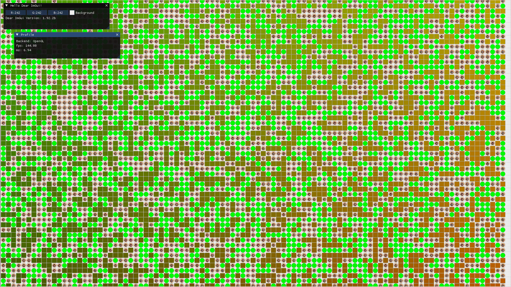

<div align="center">
  
  <h1>Sol</h1>
  <p>Written in Zig 0.15.1</p>
</div>

⚠️ **Early-stage, experimental framework**

## Overview

**Sol** is an opinionated, cross-platform rendering framework built in Zig, centered around the idea of an **infinite canvas**.

At its core, Sol provides a high-performance 2D canvas designed for large, unbounded spaces (editors, diagrams, worlds, and tools). The canvas is fully extensible: users can add **plugins** that introduce advanced rendering capabilities, including **3D scenes**, **custom shaders**, all embedded directly within the canvas.

The long-term goal is to offer an **infinite canvas API** that remains simple for 2D use cases, while allowing more advanced users to opt into **orthographic or perspective 3D rendering** within the same coordinate space.

---

## Features

### Current

- Infinite 2D canvas
- Built in rendering pipeline
- Cross-platform support (desktop and web)
- 2D shape API for drawing rectangles, circles, lines, etc.
- Cross-platform fetch API for simple networking requests

### Planned / In Progress

- Scriptable rendering pipeline
- Serialization
- Custom shaders and advanced render passes
- Plugin-based extensibility
- Optional 3D rendering inside the canvas

---

## Examples

Sol ships with a set of example applications.

Build and run an example:

```sh
zig build <example-name>

### Example 1: Shapes Demo

A demonstration of Sol's 2D shape API, drawing rectangles, circles, and lines in real-time.


